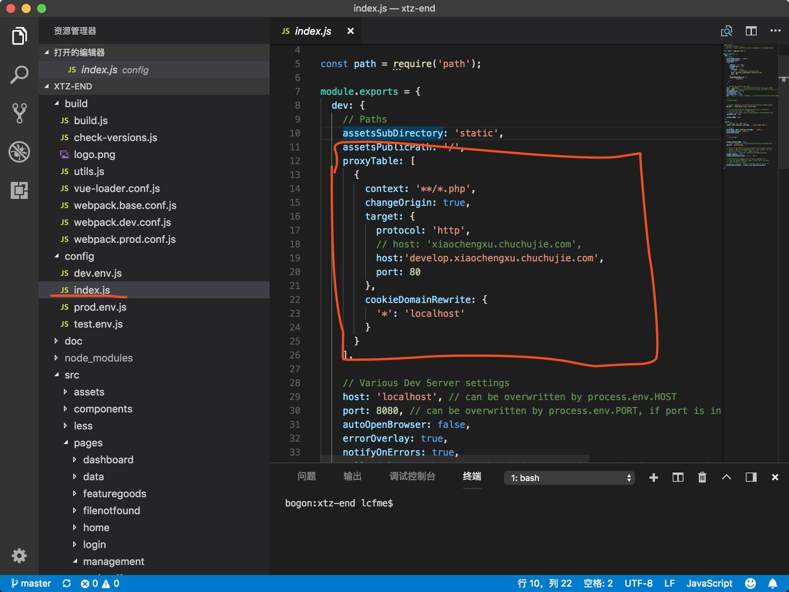
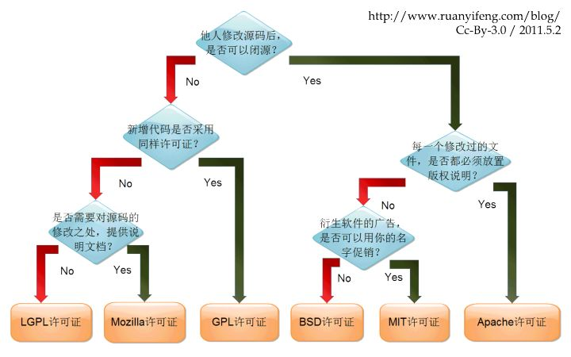

# 楚楚街技术分享

## 小团子后台项目用到的技术
项目采用webpack打包
遇到的主要问题
### 1） 跨域及认证问题
后端的认证是继续cookie的auth。如果设置access-control-allow-origin: *，在options（preflight请求）中就会被禁止。
解决方案 在dev-server中设置代理服务 dev-server的源码是用了express开启了一个服务器，其中用到了一个http-proxy-middleware的中间件

```javascript
[
  {
    context: '**/*.php',
    changeOrigin: true,
    target: {
      protocol: 'http',
      // host: 'xiaochengxu.chuchujie.com',
      host:'develop.xiaochengxu.chuchujie.com',
      port: 80
    },
    cookieDomainRewrite: {
      '*': 'localhost'
    }
  }
]

```
配置完毕后，npm run dev就可以开始运行项目了（由于config是node部分，不是src下前端热更新的代码，所以需要每一都重新运行npm run dev）
npm run 的脚本可以在 package.json 下的 script字段找到

### 2）项目中引入jQuery、bootstrap
jQuery是支持umd加载的不解释，bootstrap的加载方式异常的古老
它只是用一个函数创造了属于自己的作用域不污染全局变量，但是不支持任何模块加载机制
```javascript
(function (jQuery) {
  var $ = jQuery;
  // bootstrap code here.
})(jQuery);
```
如果在webpack项目中，入口main.js直接以
```
import 'bootstrap/dist/bootstrap.js';
```
运行时会报出异常，因为全局没有jQuery。
这是有两种解决方案，
一种是在index.html中直接引jQuery.js和bootstrap.js，然后在webpack配置中配置external代表不需要webpack管理的全局变量，
```javascript
externals: {
  jquery: 'jQuery.noConflict()' //或者jquery:'jQuery'
},

const jQuery = require('jquery');
```
copy-webpack-plugin在编译时会将项目根目录下的static文件中将jQuery、Bootstrap拷贝到dist文件下的assets中，实现静态资源。但是这种方法有弊端，bootstrap和jQuery没有被npm做版本管理。
第二种方案是用 expose-loader 全局引入 jquery
代码见 expose-loader-demo
如果引入bootstrap可能还会有问题，因为webpack在编译bootstrap会替换变量名bootstrap.js自执行函数中的参数jQuery可能会变成其他的，所以还需要providePlugin。
providePlugin的英文描述是
Automatically load modules instead of having to import or require them everywhere.
就是告诉webpack遇到变量名$ 或者 jQuery自动引入哪些包

```javascript
  new webpack.ProvidePlugin({
    $: require.resolve('jquery'),
    jQuery: require.resolve('jquery'),
  });
```

# 杂气咋吧的小知识
### 0) node 调试
node --inspect-brk 配合Chrome就可以断点执行。
### 1) require.resolve 函数
node --inspect-brk ./require-resolve-demo
```javascript
require('file'); // 会将file引入
require.resolve('file'); // 不会引入，但是会返回file的绝对路径。注意，如果file不存在会产生异常。
```

### 2) shelljs
npm: https://www.npmjs.com/package/shelljs
shelljs demo
node ./shelljs-demo

### 3) webpack模块加载远离
how-module-work
```javascript
!(function (depsArr) {
    var rootModule = {};
    function __require__(id) {
        if (!rootModule[id]) {
            var module = {};
            module.id = id;
            module.exports = {};
            depsArr[id](module.exports, module, __require__);
            rootModule[id] = module;
            return module.exports;
        } else {
            return rootModule[id].exports;
        }
    }
    __require__(0);
})([
    function (exports, module, require) {
        var a = require(1);
        var b = require(2);
        var c = require(3);
        var d = require(3);
        console.log('var a = ', a);
        console.log('var b = ', b);
        console.log('c = ', c)
        console.log('c === d; ', c === d);
    },
    function (exports, module, require) {
        exports.name = 1;
    },
    function (exports, module, require) {
        module.exports = {
            msg: 'ok',
        }
    },
    function (exports, module, require) {
        var a = {
            data: [{a: 1}],
            status: 'ok',
        }
        console.log('<<<<<<');
        module.exports = a;
    }
])
```
以上代码也解释了为什么exports不能直接被赋值

### 4）excelify
将txt专程excel的插件
npm: https://www.npmjs.com/package/exelify
该项目需要npm install -g exelify 全局安装
package.json 全局配置
```javascript
 {
   "bin": "./bin.js", /* bin代表向外暴露环境变量的脚本名称 */
   "main": "./index.js", /* 通过require引入时的入口文件 默认就是index.js */
 }
```

### 5) a-json-parser
npm: https://www.npmjs.com/package/a-json-parser



自己写的一个JSON parser 可以在json中加入注释，对象的键也不需要严格双引号。

用到了webpack umd打包，先词法分析再递归向下完成解析。


# 几种开源协议的区别
